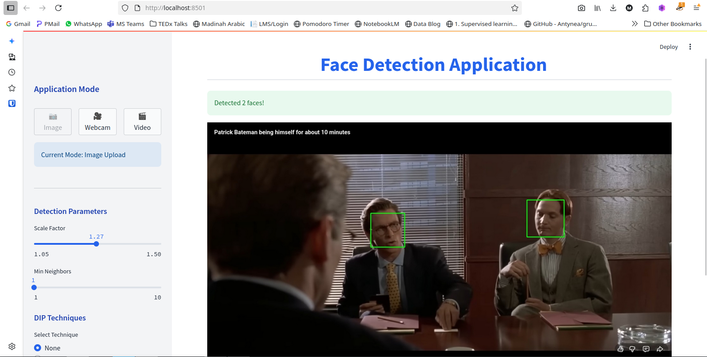

# Face Detection Application

A real-time face detection application built with Streamlit and OpenCV Haar Cascades, featuring image processing filters and webcam support.


---


## Features

- 📸 **Image Upload Mode**: Upload and process images with face detection
- 🎥 **Real-time Webcam Mode**: Live face detection from your camera
- 🎨 **Image Processing Filters**: Gaussian blur, edge detection, brightness/contrast adjustment
- ⚙️ **Adjustable Detection Parameters**: Fine-tune scale factor and min neighbors
- 💾 **Save Captured Frames**: Export processed images with detections

## Quick Start

### Prerequisites

- Python 3.8 or higher
- Webcam (optional, for real-time detection)

### Installation

1. **Clone the repository**:
   ```bash
   git clone <your-repo-url>
   cd Face-Detection-App
   ```

2. **Install dependencies**:
   ```bash
   pip install -r requirements.txt
   ```

3. **Run the application**:
   ```bash
   streamlit run app.py
   ```

The app will open in your default browser at `http://localhost:8501`.

### Docker Installation (Alternative)

```bash
docker build -t face-detection-app .
docker run -p 8501:8501 face-detection-app
```

## Usage

### Image Mode
1. Click **"📷 Image Mode"** in the sidebar
2. Upload an image (JPG, JPEG, or PNG)
3. Adjust detection parameters and filters
4. Click **"Detect Faces"** to see results

### Webcam Mode
1. Click **"🎥 Webcam Mode"** in the sidebar
2. Choose processing mode:
   - **Continuous Detection**: Real-time face detection
   - **Detection on Demand**: Detect only when you click
   - **Filter Only**: Apply filters without detection
3. Click **"Start Webcam"**
4. Use **"📸 Save Current Frame"** to export images

## Configuration

Adjust detection sensitivity in the sidebar:
- **Scale Factor** (1.05-1.5): Lower = more sensitive but slower
- **Min Neighbors** (1-10): Higher = fewer false positives

## Troubleshooting

### Webcam Issues
- **Camera not detected**: Check permissions and connections
- **Multiple cameras**: The app tries indices 0-4 automatically
- **Linux**: Ensure user is in `video` group: `sudo usermod -a -G video $USER`

### Performance
- Use smaller images for faster processing
- Reduce webcam resolution in `.streamlit/config.toml`
- Try simpler filters (Gaussian blur vs. edge detection)

### Missing Haar Cascades
If cascade files aren't found, they'll fall back to OpenCV's built-in paths automatically.

## Development

### Running Tests
```bash
pip install pytest pytest-cov
pytest tests/ -v
pytest tests/ --cov=src --cov-report=html
```

### Code Formatting
```bash
pip install black mypy
black src/ tests/
mypy src/
```

### Project Structure
```
DIP_Project/
├── app.py                  # Entry point
├── src/
│   ├── config.py          # Configuration and paths
│   ├── detector.py        # Face detection logic
│   ├── main.py            # Streamlit UI
│   ├── style.py           # CSS styling
│   └── utils/
│       └── visualization.py  # Drawing utilities
├── haarcascades/          # Haar cascade XML files
├── tests/                 # Unit tests
├── .streamlit/            # Streamlit config
├── requirements.txt       # Dependencies
└── Dockerfile            # Container setup
```

## Dependencies

- `streamlit`: Web UI framework
- `opencv-python-headless`: Computer vision (no GUI dependencies)
- `numpy`: Numerical operations
- `pillow`: Image processing

See `requirements.txt` for pinned versions.

## Future Enhancements

- [ ] DNN-based face detection (more accurate)
- [ ] MediaPipe face mesh integration
- [ ] Video file upload and processing
- [ ] Face recognition capabilities
- [ ] Export detection metrics (CSV/JSON)

## License

MIT License - see LICENSE file for details.

## Contributing

Contributions are welcome! Please:
1. Fork the repository
2. Create a feature branch
3. Add tests for new features
4. Submit a pull request

## Acknowledgments

- OpenCV Haar Cascades for face detection
- Streamlit for the interactive UI framework